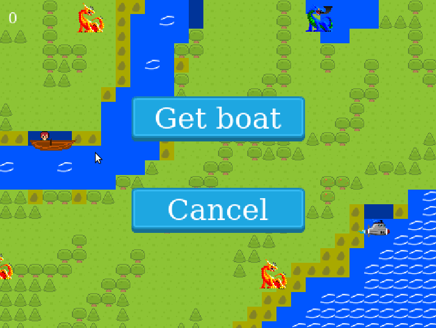

# 👟 Escape - RPG Game 👟 

> Do you want to escape from the island. It won't be easy

> Use different vehicles, battle with enemies

## Live Demo

[Live Demo Link](https://escape-rpg-game.netlify.app/)

## Description

This project is part of the Technical Curriculum of the Full Stack Web Development Program.

## Built with

- JavaScript
- Phaser
- Webpack
- Netlify
- Jest
- Tiled
- Pixelorama

## ⭐ Getting Started ⭐

### Prerequisites

- A modern browser, up to date.
- Node.js, if you are going to use it in the local environment.

### Usage

- Click the [Live Demo Link](https://escape-rpg-game.netlify.app/) and enjoy the game.

## Setup

- Clone this repository
- Open terminal
- Change directory by using `cd escape-rpg-game/`
- Run `npm install`

Then,

- Run `npm run start`

## Gameplay

### Controls

#### In Map,

Keyboard arrow keys

- Up: Go up
- Down: Go Down
- Left: Go left
- Right: Go right

#### Mouse

- Click one of the buttons shown

#### In Battle,

#### Arrow keys

- Up: Choose the next option in the menu
- Down: Choose the previous option in the menu
- Left: Change submenu. If the enemy has chosen in the most left menu, attack to the enemy

## Logic

- There two different enemy groups; visible and hidden enemies
- There are four visible dragons. To finish the game, three of them must be killed. They are strong, so you may not kill them at the beginning of the game
- There are hidden enemies. They are weaker than visible ones. But you may find them everywhere.
- When an enemy is killed, they provide you high damage to attack any enemies and an increase in your score.
- When three of the visible enemies are killed, you may escape from the island. So, you need to take the submarine and go to the bottom right part of the map.
- When the game is finished, a scoreboard is shown.

## Development Process

### Overview

- I planned the game would have two main scenes; world and battle. In the map scene, the player can go anywhere if it is allowed. In the battle scene, the player and an enemy fight each other.

### Story and Gameplay

- Our character is wakening up on the island and should escape from this island. If enough enemies can be killed, escaping from this island is possible. Two vehicles can be used to visit the different parts of the map and escape from the island. The submarine will be activated when three of the visible enemies are killed.

### Score system

- When our character kills any enemy, the score is increased. If our character can escape from the island, a scoreboard is shown, and it contains the top 5 players in terms of score. The score is shown at the top left edge of the screen.

### Map

- Map contains three main parts; obstacles, grass, and water. More, it includes small areas to take or take off any vehicle. To build the map, [Tiled](https://www.mapeditor.org/) is used.

### Animations and textures

- To build some animations and textures, [Pixelorama](https://github.com/Orama-Interactive/Pixelorama) is used.

## Test

Follow the setup part. Then;

- Run "npm run test" in your terminal

## Authors

Reach out to me at one of the following places!

👤 **Hasan Özovalı**

- LinkedIn: [Hasan Ozovali](https://www.linkedin.com/in/hasan-ozovali/)
- Github: [@ozovalihasan](https://github.com/ozovalihasan)
- Twitter: [@ozovalihasan](https://twitter.com/ozovalihasan)
- Mail: [ozovalihasan@gmail.com](ozovalihasan@gmail.com)

## Contributing 🤝

Contributions, issues, and feature requests are welcome!

Feel free to check the [issues page](https://github.com/ozovalihasan/escape-rpg-game/issues).

## Acknowledgments

Thanks to;

- [Microverse](http://microverse.org/) for its support.
- Members of the [opengameart](https://opengameart.org) for supplied material.
- [phasertutorials](https://phasertutorials.com/creating-a-phaser-3-template-part-1/) for the template of the game.
- [gamedevacademy](https://gamedevacademy.org/how-to-create-a-turn-based-rpg-game-in-phaser-3-part-1/) for the amazing tutorial.

## Show your support

Give a ⭐️ if you like this project!

## License

- **[MIT license](http://opensource.org/licenses/mit-license.php)**
